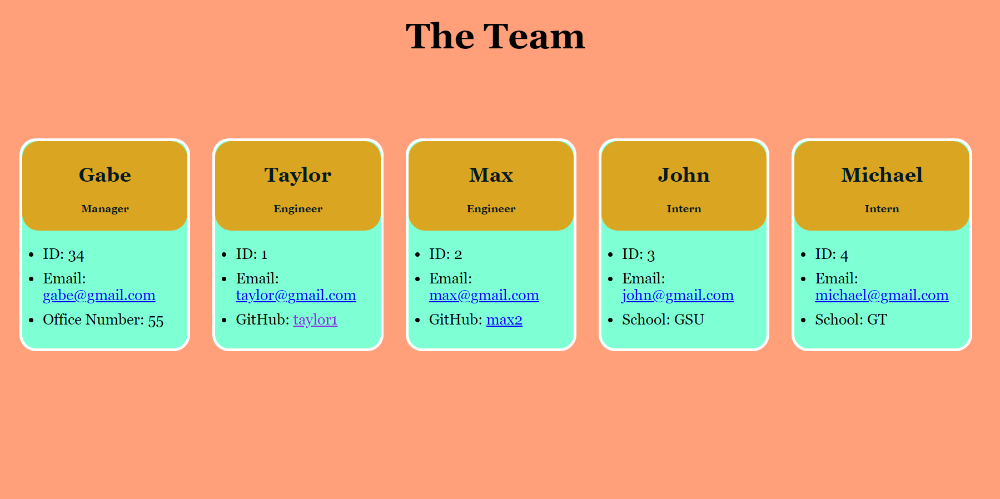

  # Team Profile Generator

  

  ## Table of Contents:

  * [Description](#Description)

  * [Installation](#Installation)

  * [Usage](#Usage)

  * [Contributions](#Contributions)

  * [Test](#Tests)

  * [Email](#Questions)

  * [Github](#Questions)

  ## Description: 
  This project uses the inquirer module to prompt user input to make a team consisting of a single manager and as many engineers and interns as needed.

  ## Installation: 
  This project requires node, inquirer, jest and babel
  
  ## Usage: 
  Here is a walkthrough video demonstrating how the application works: 
  https://drive.google.com/file/d/1Ru3-BA56pZxrhGPSZJZjRqFBJLi_N2qs/view

  ## License:
  none 
  
  ## Contributions: 
  No contributions are necessary

  ## Tests: 
  Run npm test in the terminal to test through jest

  ## Questions:

  [Email](mailto:gabeab34@gmail.com)

  [GitHub](https://github.com/gabeab34)

